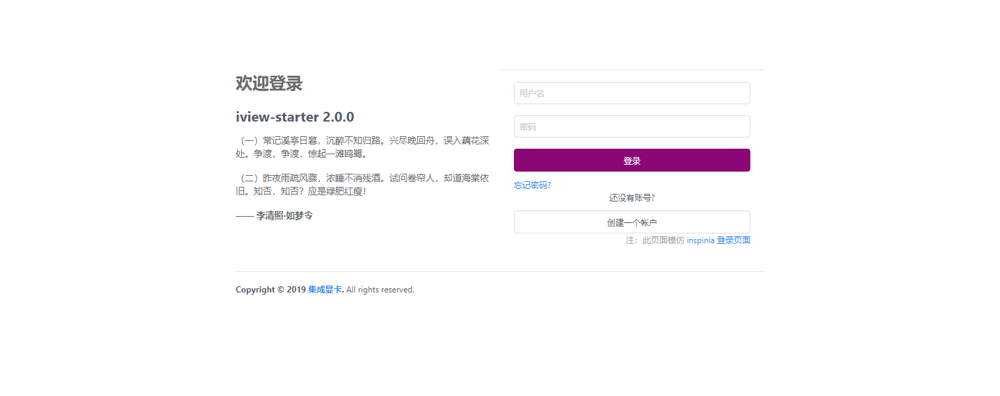
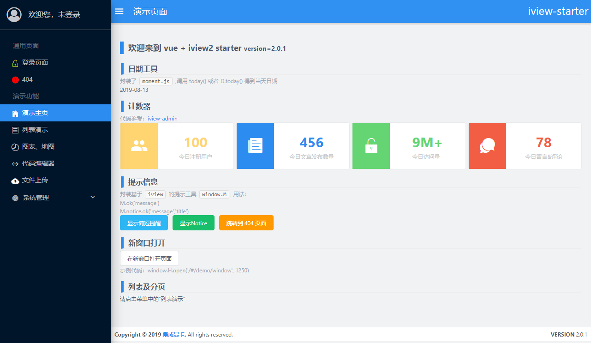
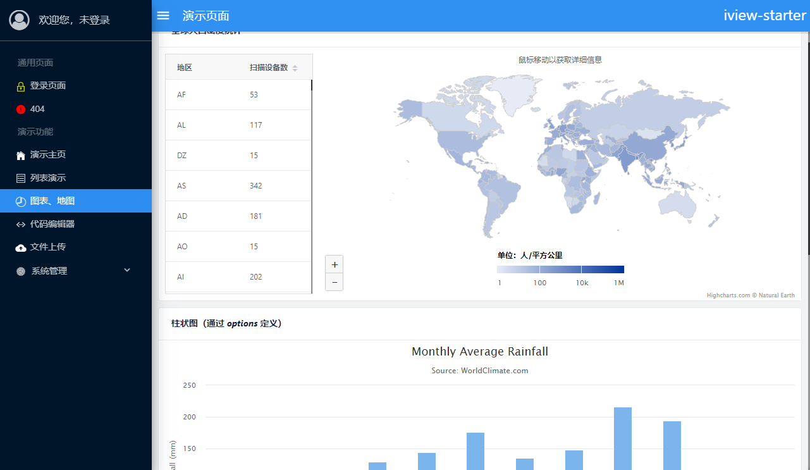
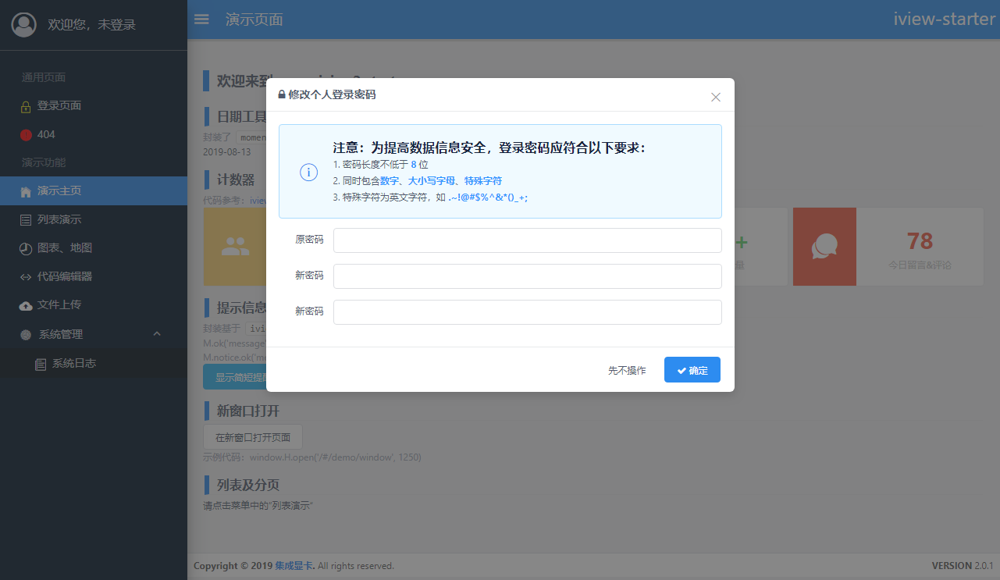

# vue-iview-starter

> vue-cli3 + iview4 starter 💛






## 说明

此项目基于[vue-cli3](https://cli.vuejs.org/)构建，并作了以下调整：

1. 默认加载`font-awesome4.7.0`（在`index.html`中引入）
2. `proxy.js`定义开发阶段的请求转发


### 鸣谢

[iview-admin](https://github.com/iview/iview-admin/blob/dev/src/views/Main.vue)

## 如何使用
> 建议使用`VSCode`进行开发，推荐安装`VueHelper`插件 👍

``` bash
# install dependencies
npm install

# serve with hot reload at localhost:8080
npm run dev 或者 npm run serve

# build for production with minification
npm run build

# 构建并打包成 static.zip
npm run zip
```

For a detailed explanation on how things work, check out the [guide](http://vuejs-templates.github.io/webpack/) and [docs for vue-loader](http://vuejs.github.io/vue-loader).


## 更新日志
> `2019年2月27日` 升级到`2.x`

### v2.3.0
- [x] 图表库更换成`echarts`
- [x] 增加主题色切换功能
- [x] 完善列表页模板：src\components\macro\page.tpl.vue

### v2.2.0
- [x] 升级`iview`到`view-design`

### v.2.1.0
- [x] 升级`vue`、`vue-router`、`vue-cli`等控件的版本
- [x] 优化界面

### v.2.0.1
- [x] `iview` 升级到 `3.4.2`
- [x] 增加新窗口打开页面的功能（详见 `src/views/demo/NewWindow.vue`）

### v.2.0.0
- [x] 基于`vue-cli3`搭建
- [x] 重构部分代码及目录结构
- [x] 新增两个登录页面（详见`src/views/login/Login.2.vue`,`src/views/login/Login.3.vue`）
- [x] 优化`http.js`，支持 JSON 格式数据的提交
- [x] 优化右侧菜单栏（再次感谢[iview-admin](https://github.com/iview/iview-admin)）

---

### v.1.0.0

* 新建项目
* 实现基本列表演示

### v.1.0.1

* iview 版本更新到 `2.12.0`
* 修改全局字体（参考 [ant-design](https://github.com/ant-design/ant-design/) ）
* 隐藏菜单栏滚动条、全局滚动条样式
* 更改登录页面（参考 [ant-design-pro](https://github.com/ant-design/ant-design-pro))

### v.1.0.2

* `vue` 升级到 `2.5.16`
* `iview` 升级到 `2.13.1`
* `page.tpl.vue` 增加 `_delWithForm` 方法（需要后端的支持，对应api `clean`）
* 增加`upload`组件及其演示

### v.1.0.3

* `iview` 升级到`2.14.3`
* 增加主题模板（修改 src/theme.less 可修改主色调）
* 更改 404 页面，资源来自[mateossh](https://github.com/mateossh/404)
* 修复`SubMenu`主键重复的 issue
* 增加 UI 样式（`code`, `h2`, `h3`等）
* 调整 `404` 页面的路由设置

### v.1.0.4

* `iview` 升级到 `3.0.0` 
* demo 页面适配 iview 新版本（较多组件都发生变化，如 Button、Icon，需要耐心修改）🔋
* 调整左侧`菜单`项的高度
* 增加`JWT`的支持（在 `Login.vue`、`util/index.js`中把相关注释去掉即可开启），后端可以参考[boot-mongo-starter](https://github.com/0604hx/boot-mongo-starter)