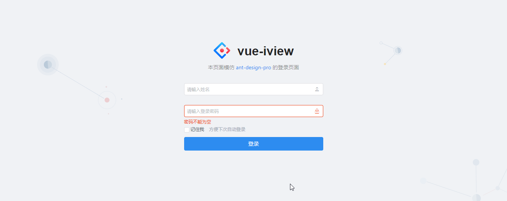
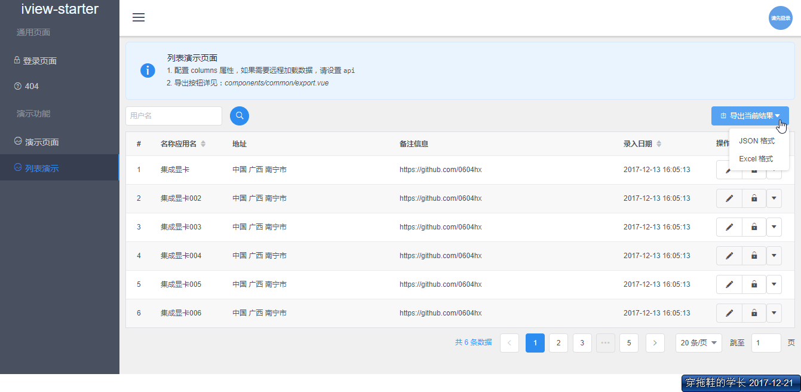
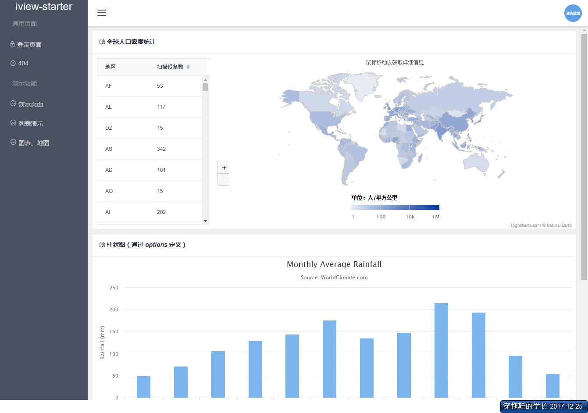
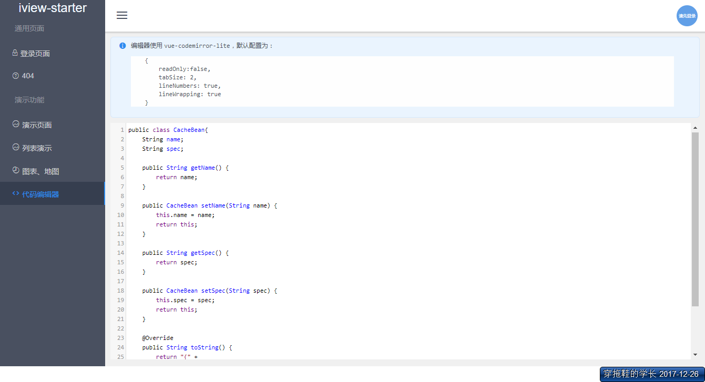

# vue-iview-starter

> vue + iview + webpack starter 💛










## 说明

此项目基于[vue-webpack-template](https://github.com/vuejs-templates/webpack)构建，并作了以下调整：

1. 不使用 PostCSS：`webpack.dev.conf.js`、`webpack.prod.conf.js` 中的 `usePostCSS` 均设置为 `false`
2. 打包项目时不生成 `map文件`，如需打开请设置 `config/index.js` 的 `productionSourceMap` 为 `true`
3. 打包时压缩 js、css 文件，如需关闭请设置 `config/index.js` 的 `productionGzip` 为 `false`


### 鸣谢

[iview-admin](https://github.com/iview/iview-admin/blob/dev/src/views/Main.vue)

## 如何使用
> 建议使用`VSCode`进行开发，推荐安装`VueHelper`插件 👍

``` bash
# install dependencies
npm install

# serve with hot reload at localhost:8080
npm run dev

# build for production with minification
npm run build

# build for production and view the bundle analyzer report
npm run build --report

# 构建并打包成 static.zip
npm run zip

# 只打包
num run zip-only
```

For a detailed explanation on how things work, check out the [guide](http://vuejs-templates.github.io/webpack/) and [docs for vue-loader](http://vuejs.github.io/vue-loader).


## 更新日志

### v.1.0.0

* 新建项目
* 实现基本列表演示

### v.1.0.1

* iview 版本更新到 `2.12.0`
* 修改全局字体（参考 [ant-design](https://github.com/ant-design/ant-design/) ）
* 隐藏菜单栏滚动条、全局滚动条样式
* 更改登录页面（参考 [ant-design-pro](https://github.com/ant-design/ant-design-pro))

### v.1.0.2

* `vue` 升级到 `2.5.16`
* `iview` 升级到 `2.13.1`
* `page.tpl.vue` 增加 `_delWithForm` 方法（需要后端的支持，对应api `clean`）
* 增加`upload`组件及其演示

### v.1.0.3

* `iview` 升级到`2.14.3`
* 增加主题模板（修改 src/theme.less 可修改主色调）
* 更改 404 页面，资源来自[mateossh](https://github.com/mateossh/404)
* 修复`SubMenu`主键重复的 issue
* 增加 UI 样式（`code`, `h2`, `h3`等）
* 调整 `404` 页面的路由设置

### v.1.0.4

* `iview` 升级到 `3.0.0` 
* demo 页面适配 iview 新版本（较多组件都发生变化，如 Button、Icon，需要耐心修改）🔋
* 调整左侧`菜单`项的高度
* 增加`JWT`的支持（在 `Login.vue`、`util/index.js`中把相关注释去掉即可开启），后端可以参考[boot-mongo-starter](https://github.com/0604hx/boot-mongo-starter)