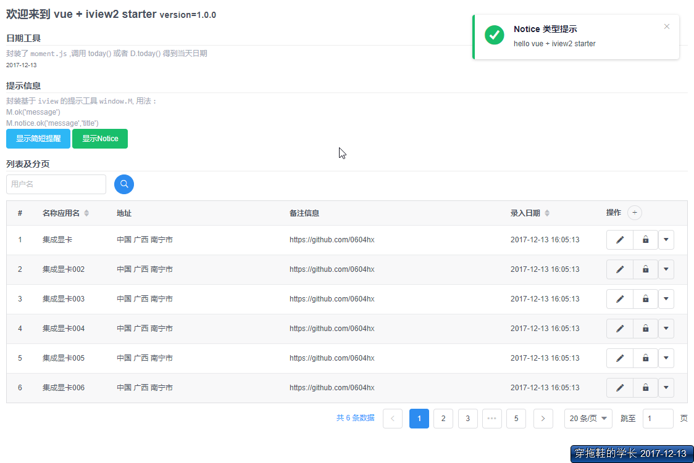

# vue-iview-starter

> vue + iview + webpack starter



## 说明

此项目基于[vue-webpack-template](https://github.com/vuejs-templates/webpack)构建，并作了以下调整：

1. 不使用 PostCSS：`webpack.dev.conf.js`、`webpack.prod.conf.js` 中的 `usePostCSS` 均设置为 `false`
2. 打包项目时不生成 `map文件`，如需打开请设置 `config/index.js` 的 `productionSourceMap` 为 `true`
3. 打包时压缩 js、css 文件，如需关闭请设置 `config/index.js` 的 `productionGzip` 为 `false`

### 鸣谢

[iview-admin](https://github.com/iview/iview-admin/blob/dev/src/views/Main.vue)

## 如何使用

``` bash
# install dependencies
npm install

# serve with hot reload at localhost:8080
npm run dev

# build for production with minification
npm run build

# build for production and view the bundle analyzer report
npm run build --report
```

For a detailed explanation on how things work, check out the [guide](http://vuejs-templates.github.io/webpack/) and [docs for vue-loader](http://vuejs.github.io/vue-loader).
